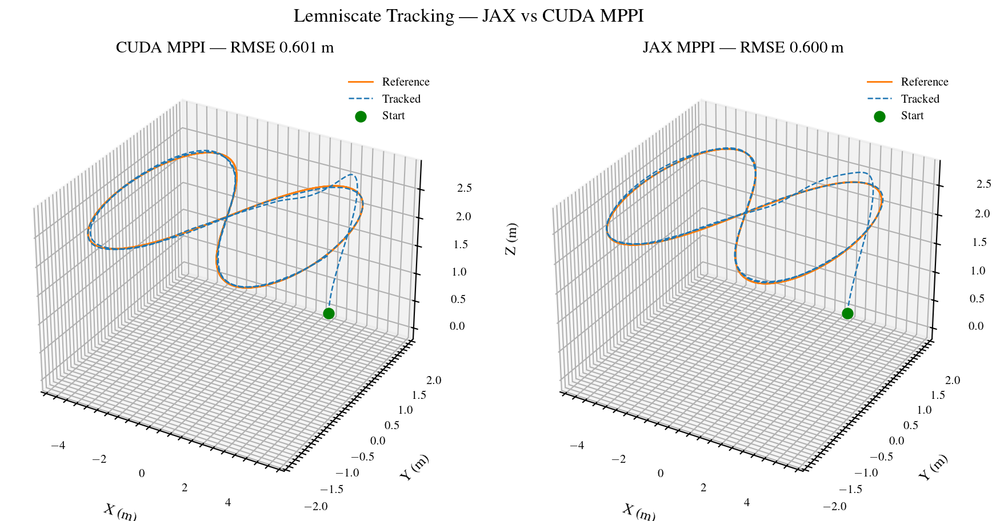
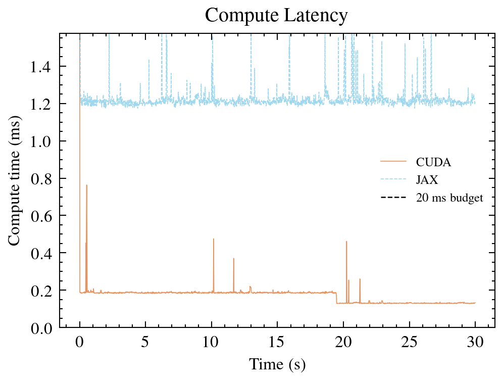

# Overview

**cuda-mppi** is a high-performance, GPU-accelerated library for Model Predictive Path Integral (MPPI) control. It provides a flexible C++ core with Python bindings, designed to serve as the backend for advanced autonomous navigation and control research.

::: {.callout-warning}
## Important - Development

This repository is currently in active development. It **should not** be used for production purposes.
:::

## Key Features

*   **Speed**: Pure CUDA implementation capable of evaluating thousands of trajectories in parallel at hundreds of Hz.
*   **Flexibility**: Template-based architecture allows for zero-overhead swapping of Dynamics and Cost functions.
*   **Multiple variants**: Standard MPPI, Smooth MPPI (S-MPPI), Kernel MPPI (K-MPPI), B-Spline MPPI, and Informative MPPI (I-MPPI) — all exposed to Python.
*   **JIT Compilation**: Define dynamics and cost in C++/CUDA strings; the library compiles a `.cubin` at runtime via NVRTC.
*   **Pixi environment**: reproducible builds pinned through a conda-forge lock file.

## Performance snapshot

Lemniscate tracking, 30 s, K=900 rollouts, N=40, dt=0.02 s:

| Controller | RMSE (m) | Compute / step |
|------------|----------|----------------|
| MPPI       | 0.60     | 0.17 ms        |
| K-MPPI     | 0.79     | 0.03 ms        |
| S-MPPI     | -- ([#30](https://github.com/riccardo-enr/cuda-mppi/issues/30)) | -- |

### JAX vs CUDA MPPI

Same algorithm, same GPU, different stack. Both run quadrotor lemniscate
tracking with identical parameters.





Reproduce with:

```bash
pixi run python scripts/bench_jax_mppi.py --compare --plot
```

## Documentation Structure

### [Getting Started](intro/getting_started.qmd)
Installation instructions for C++ standalone usage and Python integration.

### [Core Concepts](core/architecture.qmd)
Understanding the architecture, memory model, and [JIT Compilation](core/jit.qmd).

### [Controllers](controllers/controllers.qmd)
Detailed theoretical derivation and usage of the reactive tracking controllers.

### [Planners](controllers/i_mppi.qmd)
Documentation for the Informative-MPPI (I-MPPI) exploration planner.

### [API Reference](api/python_api.qmd)
Python API documentation for `cuda_mppi`.

## License

MIT License.
